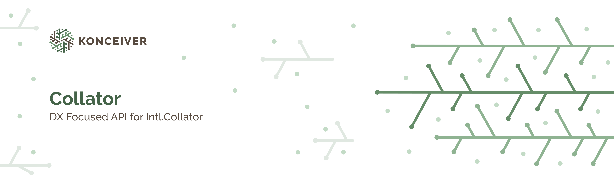

# @konceiver/collator

<p align="center"></p>

[](https://npmjs.com/package/@konceiver/collator)
[](https://npmjs.com/package/@konceiver/collator)
[](https://github.com/konceiver/collator/actions?query=workflow%3Arun-tests+branch%3Amaster)
[](https://codeclimate.com/github/konceiver/collator)
[](https://codeclimate.com/github/konceiver/collator)
[](https://npmjs.com/package/@konceiver/collator)

This package was created by, and is maintained by [Brian Faust](https://github.com/faustbrian), and provides a developer experience focused API for [Intl.Collator](https://developer.mozilla.org/en-US/docs/Web/JavaScript/Reference/Global_Objects/Intl/Collator).

## Installation

```bash
yarn add @konceiver/collator
```

## Testing

```bash
yarn test
```

## Changelog

Please see [CHANGELOG](CHANGELOG.md) for more information on what has changed recently.

## Contributing

Please see [CONTRIBUTING](CONTRIBUTING.md) for details.

## Security

If you discover a security vulnerability within this package, please send an e-mail to security@konceiver.dev. All security vulnerabilities will be promptly addressed.

## Credits

This project exists thanks to all the people who [contribute](../../contributors).

## Support Us

We invest a lot of resources into creating and maintaining our packages. You can support us and the development through [GitHub Sponsors](https://github.com/sponsors/faustbrian).

## License

collator is an open-sourced software licensed under the [MIT](LICENSE.md).
